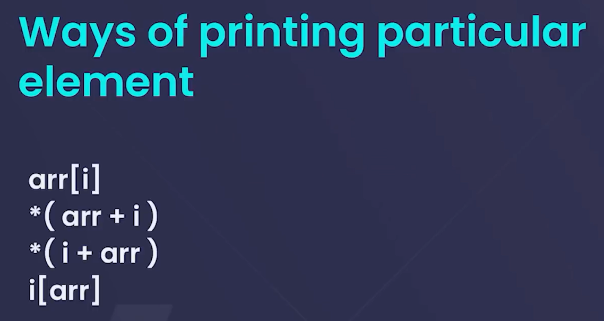

# BASICS
- array is a collection of elements of same data type stored in contiguous memory locations.
- when we pass an array as an argument to a function , address of the first element of the
  array gets passed .

# WAYS OF PRINTING PARTICULAR ELEMENTS

### MEMORY ALLOCATION IN ARRAY
- array allocation in arrays  is contiguous / continous  
  memory allocation .   

### remember

'''c

int num[5] ;   // 5 int elements in contiguous memory locations

int num[5] = 11 ;   // 6th int element of an array

'''
## ERROR

### out of bound  
- if we assign  a value to an index that is greater than the size of the array, it is called index out of bound error.

# PASSING ARRAY TO FUNCTION 
- types of calls to a function are call by reference or call by value.
  - call by value : copy of array elements is passed to function. changes made in function does not affect original array .
  - call by referance : address of array elements is passed to function. changes made in function  affect original array .
### but in array
- The array in C are passed to functions by reference, not by value. This means  
  when you pass an array to a function, you are passing the address of the first
  element of the array, not a copy of the array.