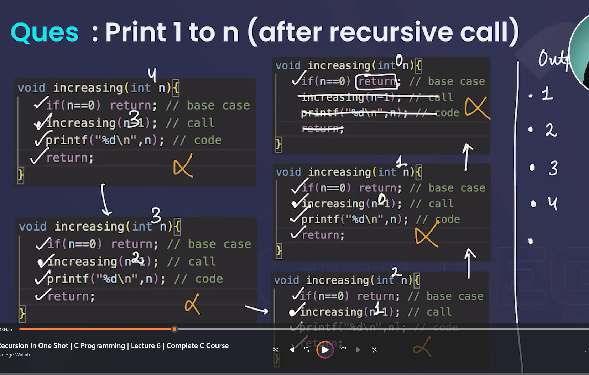
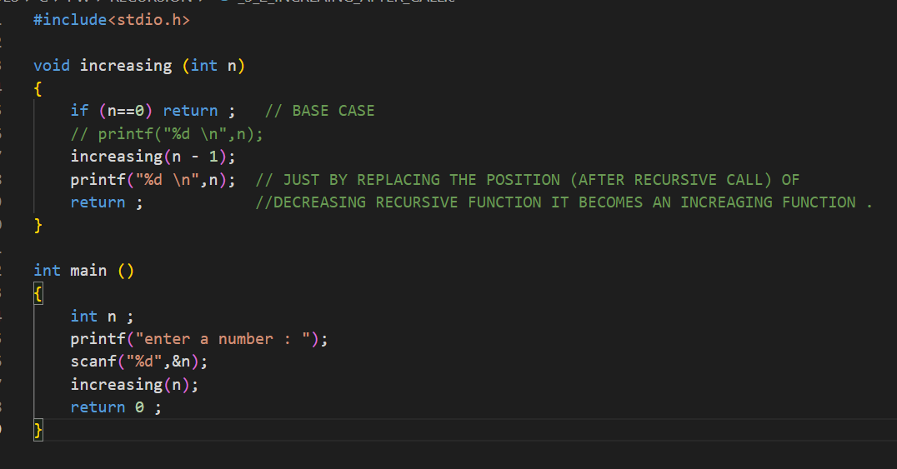

## EXPLANATION OF AFTER RECURSIVE CALL
 ctrl + k then v to view

## let value of n = 3
### first call
- as n is not equal to 0 so second line code  will be executed ( increasing(n - 1) )
- function is called again with n = 2
as, n is still not equal to zero  so second line code  will be executed ( increasing(n - 1) )
-  function is called again with n = 1
still the same , second line code  will be executed ( increasing(n - 1) )
- now n is equal to 0 so first line code will be executed ( return n ) , this will give control to its calling 3rd void increasing(int n) , here the code will start from the point it paused so the if condition won't be checked hence and since the value of n in this function is one (not zero as that function is already terminated) so it is printed then this function is also terminated and control returns  to 2nd void increasing(int n) , here the code will start from the point it paused  so the if condition won't be checked hence and since the value of n in this function is two  (not one as that function is already terminated) so it is printed then this function is also terminated  and control returns to 1st void increasing(int n) , here the code will start from the  point it paused  so the if condition won't be checked hence and since the value of n in  this function is three  (not two as that function is already terminated) so it is printed then  this function is also terminated and control returns to main function where the code will terminate as there is no further code .

'''c

#include<stdio.h>
void increasing (int n)
{

    if (n==0) return ;   // BASE CASE
    // printf("%d \n",n);
    increasing(n - 1);
    printf("%d \n",n);  // JUST BY REPLACING THE POSITION (AFTER RECURSIVE CALL) OF 
    return ;            //DECREASING RECURSIVE FUNCTION IT BECOMES AN INCREAGING FUNCTION .
}
'''c

int main ()
{

    int n ;
    printf("enter a number : ");
    scanf("%d",&n); 
    increasing(n); 
    return 0 ;
}