# **BASICS**

- Bubble Sort is a simple comparison-based sorting algorithm. It works by repeatedly stepping through the list, comparing adjacent elements, and swapping them if they are in the wrong order. This process continues until no more swaps are needed, indicating that the list is sorted.

- **How Bubble Sort Works**

1. Compare each pair of adjacent elements in the list.

2. If the current element is greater than the next element (for ascending order), swap them.

3. Repeat the process for each element, gradually "bubbling up" the largest unsorted element to its correct position in each pass.

4. Continue the passes until the list is sorted.

- MAIN LOGIC is swap two adjacent elements .

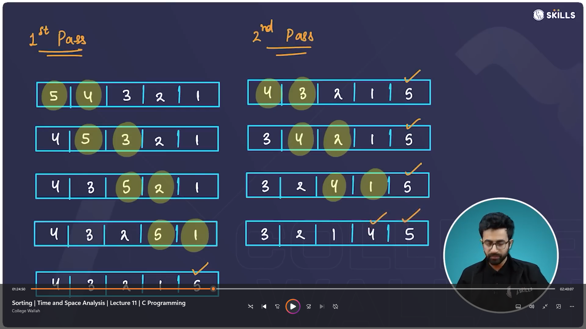

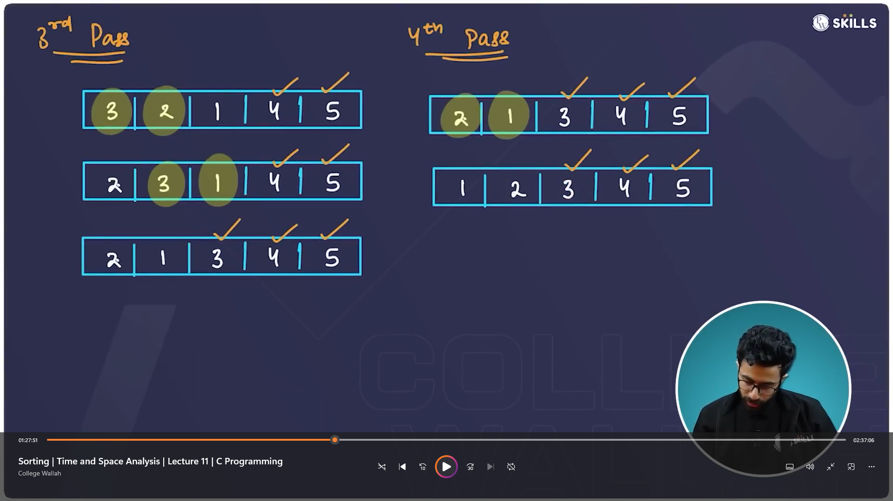

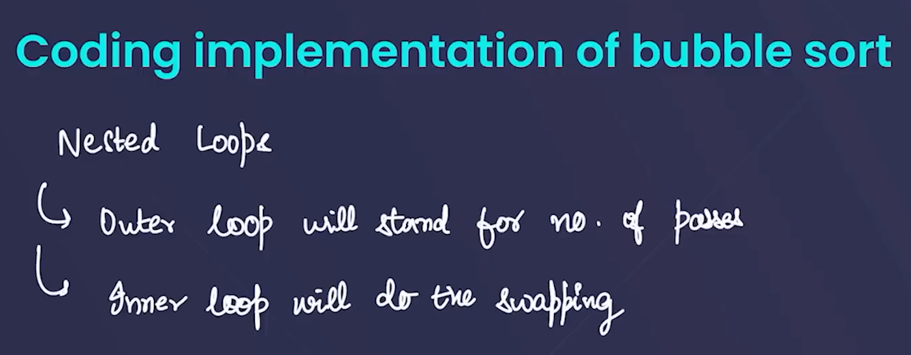

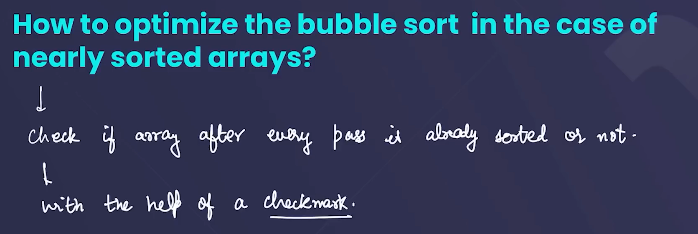

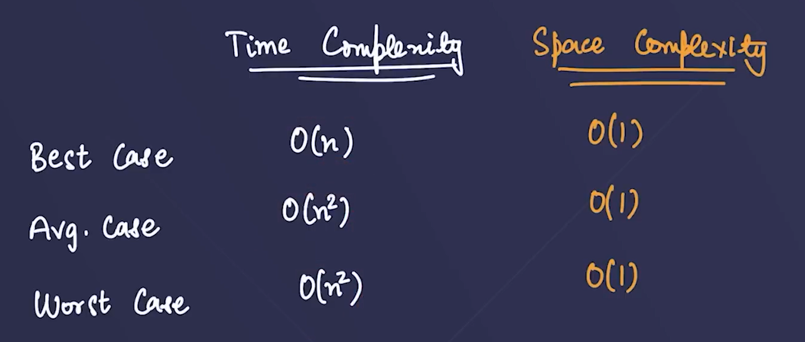

## **TIME COMPLEXITY** (IMPORTANT)

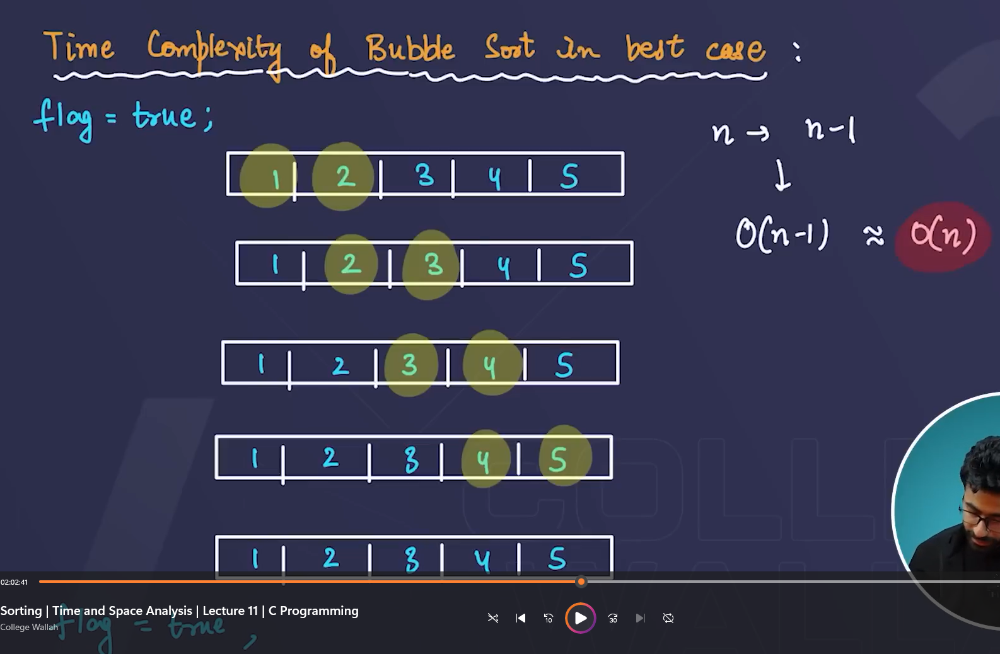

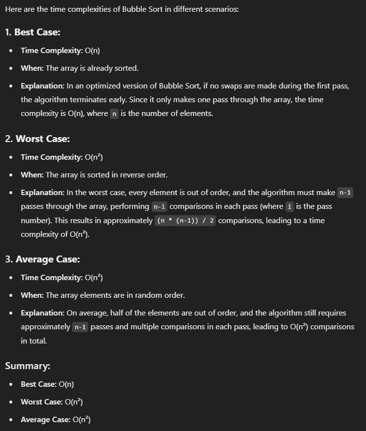

## SPACE COMPLEXITY

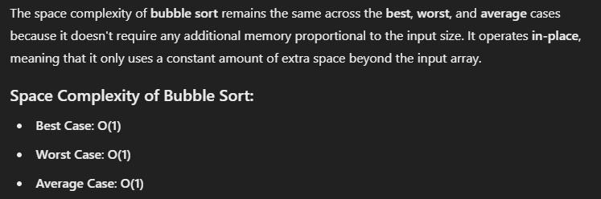

### PASSES

- In bubble sort, passes refer to the number of times the algorithm goes through the entire array to compare and potentially swap adjacent elements. Each pass ensures that the largest unsorted element "bubbles up" to its correct position ( that is last position of array) .

  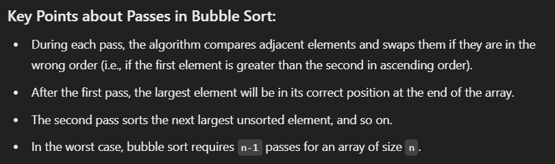

  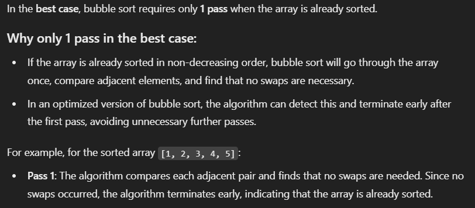

### SWAPS

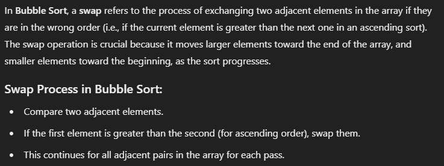

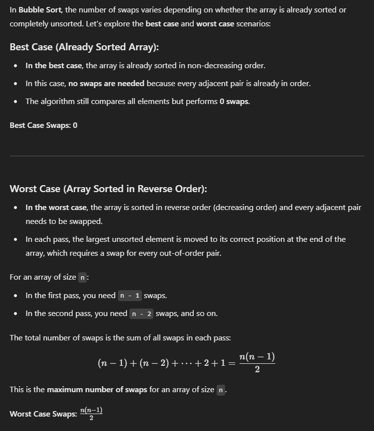

## What is Stability in Sorting?

- A sorting algorithm is considered stable if two elements with equal values appear in the same order in the sorted output as they appear in the input

### Why is Bubble Sort Stable?

- In Bubble Sort, adjacent elements are compared and swapped only if the first element is greater than the second. If two elements are equal, they are not swapped, meaning their relative order remains unchanged. This ensures that the original relative order of equal elements is preserved, making Bubble Sort stable.

### **In-Place Algorithm**

- Yes, Bubble Sort is an in-place algorithm. It repeatedly compares adjacent elements and swaps them if they are in the wrong order, but all the swaps are done within the same array. No extra array is used to store the sorted elements.
  
  **Space Complexity**: \(O(1)\) – Bubble Sort only uses a constant amount of extra memory for temporary variables used during swapping.

## **QUESTIONS**

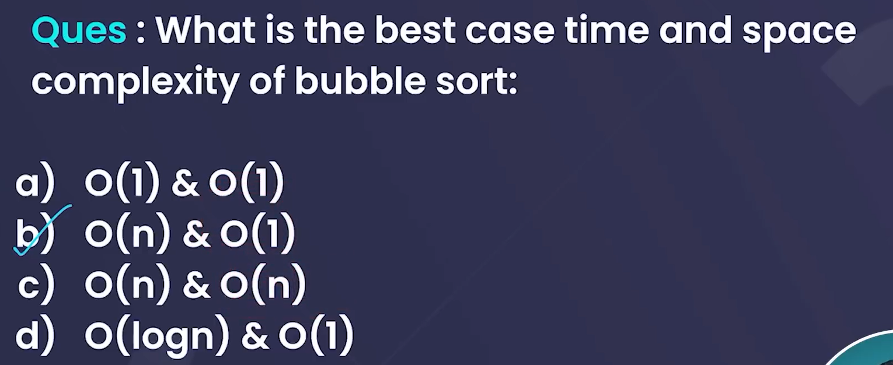

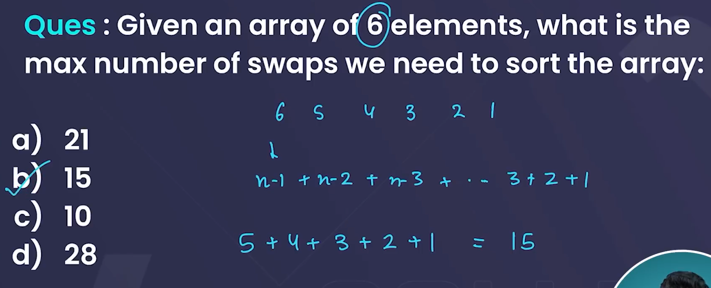
