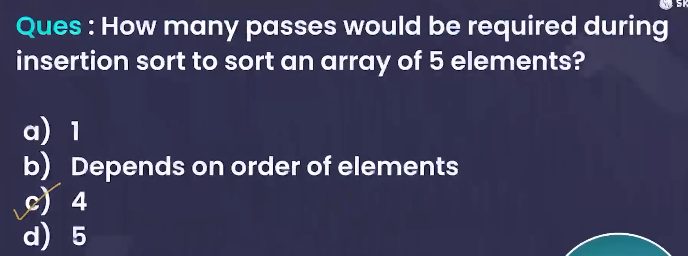

# **BASICS**

- Insertion Sort is a simple sorting algorithm that builds the final sorted array one item at a time. It is much like sorting playing cards in your hands; you pick one card and place it in the correct position relative to the cards that are already sorted.

## **How Insertion Sort works:**

1. **Start with the second element**: In the list, begin by considering the first element as already sorted. Move to the second element.
2. **Compare with the previous elements**: Compare the current element with the elements before it in the sorted part of the list.

3. **Shift elements**: If the current element is smaller than any of the previous elements, shift those elements one position to the right to make space.

4. **Insert the current element**: Place the current element in its correct position in the sorted portion.

5. **Repeat**: Move to the next element and repeat the process until the whole list is sorted.

### Example

Given the array: `[5, 2, 9, 1, 5]`

- Start with the second element `2`. Compare it with `5`, shift `5`, and insert `2` before it → `[2, 5, 9, 1, 5]`.
- Move to `9`. It's larger than `5`, so no shifting is needed → `[2, 5, 9, 1, 5]`.
- Move to `1`. Compare it with `9`, `5`, and `2`, shift all, and insert `1` → `[1, 2, 5, 9, 5]`.
- Move to the last `5`. Compare it with `9`, shift `9`, and insert `5` → `[1, 2, 5, 5, 9]`.

Now the list is sorted!

## **Time Complexity of Insertion Sort**

- **Best Case (Already Sorted List)**:  
  - **O(n)**  
    In the best case, the list is already sorted, so the algorithm only compares each element once and does no shifting. Thus, it makes only \(n - 1\) comparisons.
  
- **Worst Case (Reverse Sorted List)**:  
  - **O(n²)**  
    In the worst case, every element has to be compared with all previous elements and shifted, resulting in \(1 + 2 + 3 + ... + (n - 1)\) comparisons and shifts, which is a sum of an arithmetic series, leading to \(O(n²)\) time complexity.

- **Average Case**:  
  - **O(n²)**  
    On average, the elements are neither completely sorted nor completely reverse sorted, so about half the elements need to be shifted, which results in a quadratic time complexity.

## **Space Complexity of Insertion Sort**

- **O(1)** (Constant Space)  
  Insertion Sort is an in-place sorting algorithm, meaning it doesn’t require additional memory for sorting other than a few extra variables (like the `key` variable for insertion). Thus, its space complexity is constant, \(O(1)\).

### Summary

- **Best Case**: \(O(n)\)
- **Worst Case**: \(O(n²)\)
- **Average Case**: \(O(n²)\)
- **Space Complexity**: \(O(1)\)

In **Insertion Sort**, the terms **passes** and **swaps** refer to the steps taken to sort the array:

## 1. **Passes**

A **pass** refers to a single iteration over the unsorted part of the array where the current element is compared with the elements in the sorted part of the array. Each time the outer loop runs (starting from the second element), it's considered a pass.

For an array of size `n`, there are `n-1` passes:

- Pass 1: Sorting the first 2 elements .
- Pass 2: Sorting the first 3 elements.
- ...
- Pass `n-1`: Sorting the entire array.

## 2. **Swaps**

A **swap** refers to the action of exchanging two elements' positions. In **Insertion Sort**, swaps aren't done directly but the larger elements are shifted to the right, and the current element is inserted in its correct position.

### Example of Passes and Swaps in Insertion Sort

Given the array: `[4, 3, 2, 10, 12]`

- **Pass 1**: Compare `3` with `4` → Swap (or shift `4` to the right and insert `3`):
  - Result: `[3, 4, 2, 10, 12]`
  
- **Pass 2**: Compare `2` with `4`, then with `3` → Swap both `4` and `3` (shift them to the right and insert `2`):
  - Result: `[2, 3, 4, 10, 12]`
  
- **Pass 3**: Compare `10` with `4` → No swap needed as `10` is already in the correct place.
  - Result: `[2, 3, 4, 10, 12]`
  
- **Pass 4**: Compare `12` with `10` → No swap needed as `12` is already in the correct place.
  - Result: `[2, 3, 4, 10, 12]`

### **Summary**

- **Passes**: `n-1` passes for an array of size `n`.
- **Swaps**: Swaps (or shifts) happen when an element is smaller than previous elements, and they are moved to make space for the current element. The number of swaps depends on how unsorted the array is.

## **Number of Swaps in Insertion Sort**

- **Best Case (Already Sorted Array):**
  - **Number of Swaps = 0**
  
    In the best case, the array is already sorted. In each pass, the current element is already in its correct position, so no swaps (or shifts) are needed. The algorithm simply compares each element and moves to the next one without any shifting.

    Example (Best Case: `[1, 2, 3, 4, 5]`):
    - Pass 1: No swaps needed.
    - Pass 2: No swaps needed.
    - Pass 3: No swaps needed.
    - Pass 4: No swaps needed.

    **Total swaps = 0**

- **Worst Case (Reverse Sorted Array):**
  - **Number of Swaps = Maximum = *n*(n-1)/2**
  
    In the worst case, the array is sorted in reverse order. Each element needs to be compared and moved all the way to the beginning of the sorted part, meaning the maximum number of swaps (or shifts) occurs.
  
    For an array of size `n`, the number of swaps is the sum of the first \(n-1\) integers:  
    \[
    \text{Number of swaps} = 1 + 2 + 3 + ... + (n-1) = \frac{n(n-1)}{2}
    \]
  
    Example (Worst Case: `[5, 4, 3, 2, 1]`):
    - Pass 1: 1 swap (`5` and `4`).
    - Pass 2: 2 swaps (`5`, `4`, and `3`).
    - Pass 3: 3 swaps (`5`, `4`, `3`, and `2`).
    - Pass 4: 4 swaps (`5`, `4`, `3`, `2`, and `1`).

    **Total swaps = 10 (for \(n = 5\))**

### **Summary of swaps**

- **Best Case (already sorted array):** 0 swaps.
- **Worst Case (reverse sorted array):** \(\frac{n(n-1)}{2}\) swaps, where `n` is the number of elements in the array.

**Insertion Sort** is considered a **stable sorting algorithm** because it preserves the relative order of equal elements. In other words, if two elements are equal, their order will remain the same in the sorted array as it was in the original array.

## Why Insertion Sort is Stable

1. **Element Comparison**:
   - During the sorting process, when the algorithm compares the current element with the elements in the sorted portion, it only moves the larger elements to the right.
   - If the current element is equal to one of the elements in the sorted portion, it is inserted before that equal element, thus maintaining the original order.

2. **No Swapping of Equal Elements**:
   - Insertion Sort does not swap equal elements; it only shifts larger elements to the right. This means that if two elements have the same value, their relative order won't change during sorting.

### Example to prove inserstion sort is stable

Consider an array with duplicate elements:

- Original array: `[4, 2, 2, 3]`

During sorting:

- Pass 1: `[2, 4, 2, 3]` (Inserts the first `2` before `4`)
- Pass 2: `[2, 2, 4, 3]` (Inserts the second `2` before `4`, keeping the first `2` before it)
- Pass 3: `[2, 2, 3, 4]` (Inserts `3` before `4`)

In the sorted array `[2, 2, 3, 4]`, the two `2`s maintain their relative order as they appeared in the original array.

### Conclusion

Insertion Sort is stable because it does not disrupt the order of equal elements during the sorting process, making it useful in scenarios where the stability of the sorting is important.

## **In-Place Algorithm**

**Insertion Sort** is often described as an **in-place algorithm** because it sorts the array without requiring additional storage proportional to the input size. Here’s why it's classified as an in-place sorting algorithm:

## **QUESTIONS**

