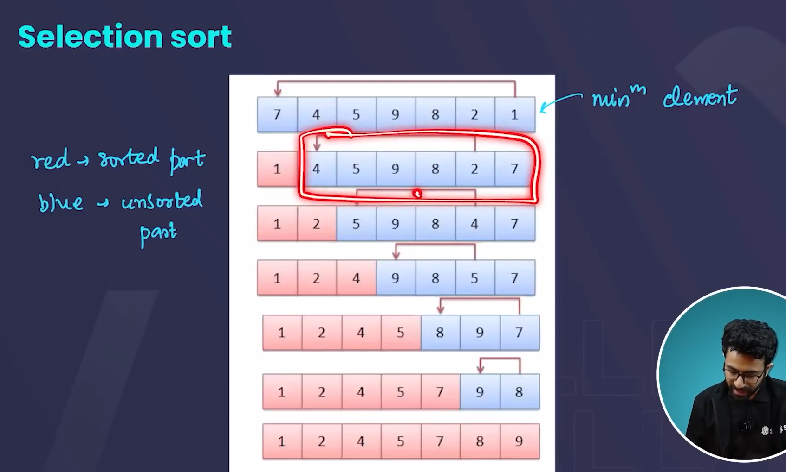
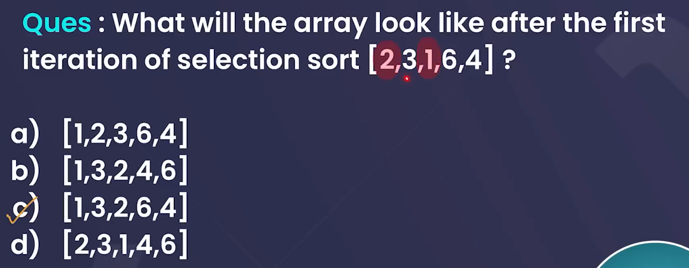
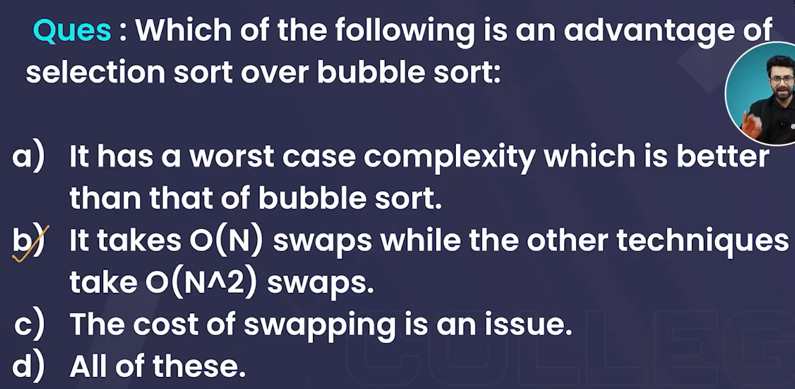

# **BASICS**

- Selection Sort is a simple comparison-based sorting algorithm. It works by repeatedly selecting the smallest (or largest, depending on the order) element from the unsorted part of the array and swapping it with the first unsorted element. This process divides the array into two parts: the sorted part and the unsorted part.

- How Selection Sort Works:

1. The algorithm starts by assuming the first element is the minimum (for ascending order).

2. It then scans the rest of the array to find the actual minimum element.

3. Once found, it swaps this minimum element with the first unsorted element.

4. This process continues, moving the boundary between the sorted and unsorted parts until the entire array is sorted.

## Time Complexity of Selection Sort

Selection Sort operates by repeatedly selecting the minimum element from the unsorted part of the array and swapping it with the first unsorted element. The time complexity depends on the number of comparisons and swaps made during the process.

### 1. **Worst Case: O(n²)**

- **Scenario**: In the worst-case scenario, the array is in reverse order or random order. Regardless of the order of the elements, the algorithm performs the same number of comparisons because it always looks for the minimum element in the unsorted part.
- **Explanation**:
  - On the first pass, the algorithm compares `n` elements.
  - On the second pass, it compares `n-1` elements, and so on.
  - Total comparisons: `n + (n-1) + (n-2) + ... + 1 = n(n-1)/2 ≈ O(n²)`.
- **Swaps**: The number of swaps in Selection Sort is at most  `n-1` because the algorithm swaps only once per pass, even in the worst case.

### 2. **Average Case: O(n²)**

- **Scenario**: The array is in random order. Similar to the worst case, the algorithm performs the same number of comparisons regardless of the array's order.
- **Explanation**:
  - The average case still requires the algorithm to scan through the entire unsorted part of the array to find the minimum element, leading to the same number of comparisons as the worst case.
  - Thus, the average time complexity is also `O(n²)`.

### 3. **Best Case: O(n²)**

- **Scenario**: Even if the array is already sorted in ascending order, the Selection Sort algorithm still performs the same number of comparisons.
- **Explanation**:
  - It does not take advantage of a sorted array, so even in the best case, it will perform `n(n-1)/2` comparisons.
  - The number of swaps will be fewer, but comparisons remain `O(n²)`.

## Space Complexity of Selection Sort

Selection Sort is an **in-place** sorting algorithm, meaning it does not require additional memory apart from a few extra variables for swapping and storing indices.

- **Space Complexity: O(1)**

  - **Explanation**: Selection Sort only uses a constant amount of additional memory (for variables like `min_idx` and `temp`), and no extra arrays or dynamic data structures are used.
  - This makes the space complexity independent of the input size.

## Summary

- **Worst-case time complexity**: O(n²)
- **Average-case time complexity**: O(n²)
- **Best-case time complexity**: O(n²) (no optimization for already sorted data)
- **Space complexity**: O(1) (in-place sorting algorithm)

In all cases, the time complexity is the same due to the lack of optimization for sorted or partially sorted arrays, while the space complexity remains minimal.

**Selection sort** is **not a stable sorting algorithm** by default.

### Explanation

A sorting algorithm is considered **stable** if it preserves the relative order of elements with equal keys (values) after sorting. In other words, if two elements have the same value and appear in a certain order in the input, they should remain in the same order in the output after sorting.

#### Why is Selection Sort Unstable?

In **Selection Sort**, during each pass, the algorithm selects the smallest (or largest) element from the unsorted portion and swaps it with the element at the current position. If this swap involves elements with the same value, the relative order of those elements can be disrupted.

## **In-Place Algorithm**

- Yes, Selection Sort is an in-place algorithm. It works by selecting the smallest (or largest) element from the unsorted part of the array and swapping it with the first unsorted element. Again, no extra space is required beyond a few variables used during the swapping process.

  **Space Complexity**: \(O(1)\) – Selection Sort also uses a constant amount of extra memory for swapping elements.

## **QUESTIONS**

