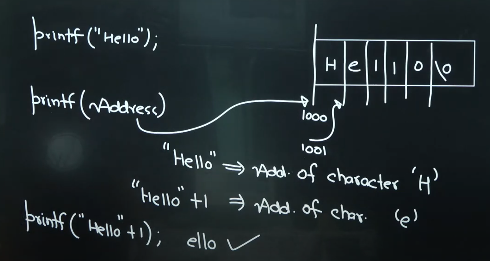
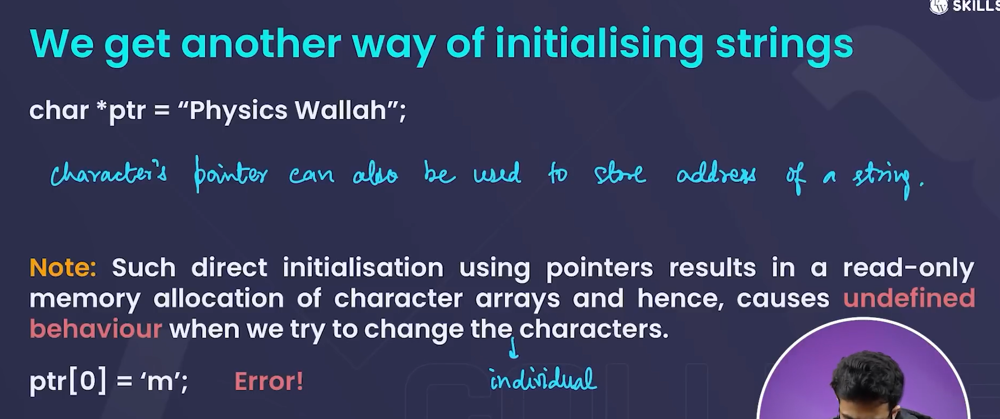

# STRINGS

- character array with a null character ( \0 ) is known as strings .
- without the null character at the end character array is not considered as an string .
- can't declare array or string without size that will generate an error but array declaration can be done at the same time without specifying size arr[] = {'a','b','c'};

## BUILT IN FUNCTION IN string.h

## ANOTHER WAY OF INITIALISING STRINGS

 new string is formed when changing the whole string and the pointer prints first character of the new string now

## COPY ONE STRING TO ANOTHER

## WAYS OF PRINTING PARTICULAR ELEMENTS

### ASCII VALUES

- 'A' = 65
- 'a' = 97
- '0' = 48
- '9' = 57

### NULL CAHARACTER ( \0 )

- Null character is represented by \0 . It is used to end a string
- ASCII value of null character ( \0 ) is zero .
- it will never be printed but stll occupy space .

#### use of null character

- it is used to  end a string , when we don't remember its size .

### STRING INITIALIZATION

#### METHOD 1

#### METHOD 2

- no need of \0 as in this method computer automatically  add \0 at the end of  string , due to this size of string increases by 1 byte example -->

- if we are assigning the size of a string always assign it one more than its actual size .

### ACCESSING  STRING ELEMENTS

- we can access string elements using index .

### MODIFYING STRING ELEMENTS

- we can modify string elements using index .

