# Structure

- user defined data type
- used to  create and store complex or diffrent data
types .
- unlike arrays structure name does not hold address of first element .
- in structure too (like array / string) elements are stored at continous memory locations .
- nesting of structure is possible .
- a structure variable can be passed to a function .

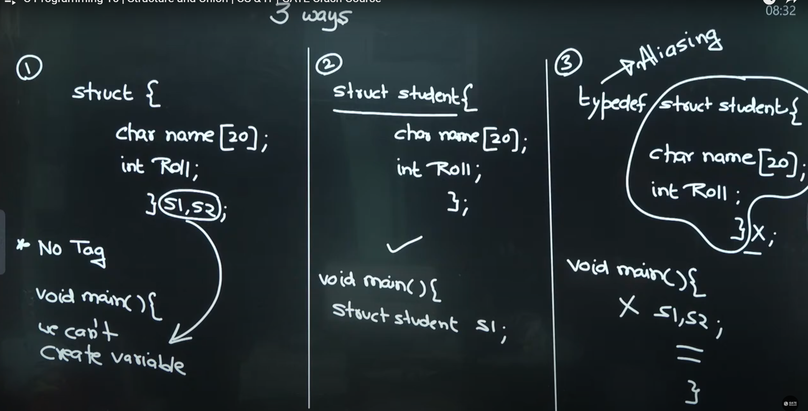

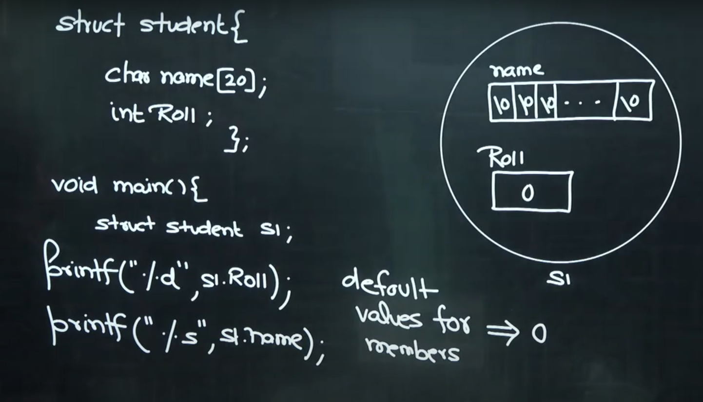

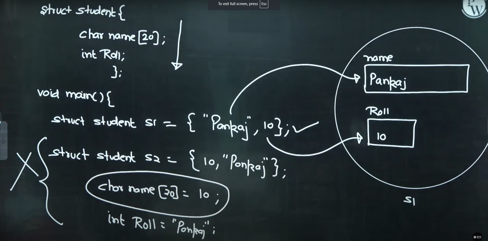

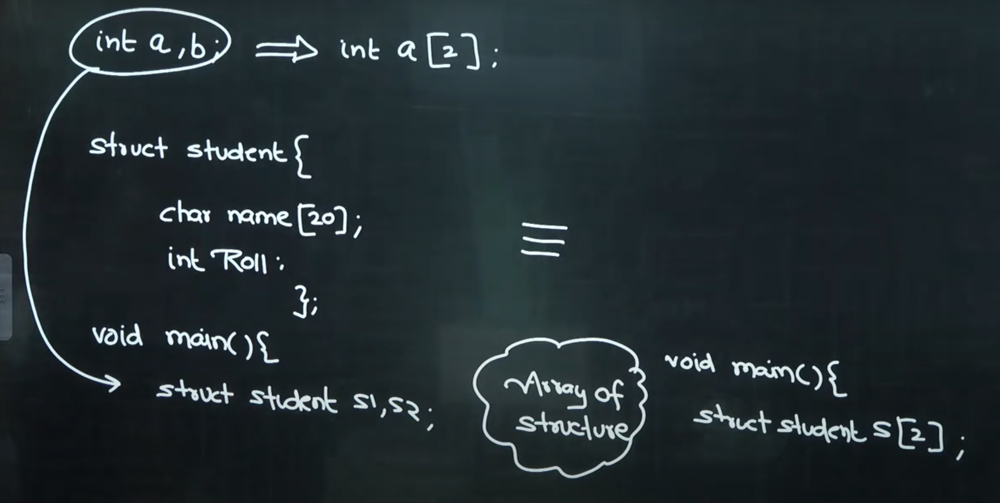

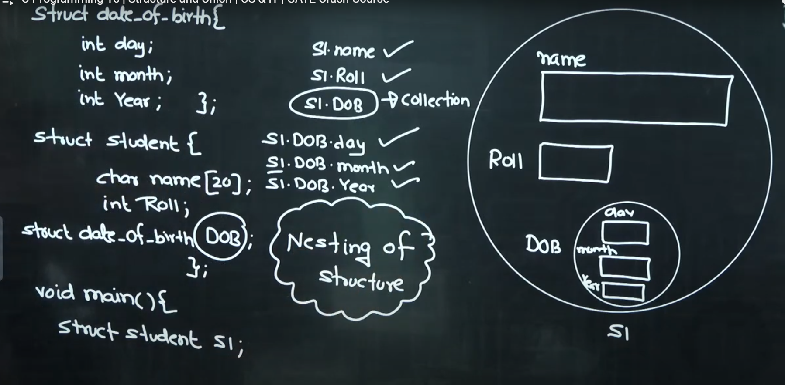

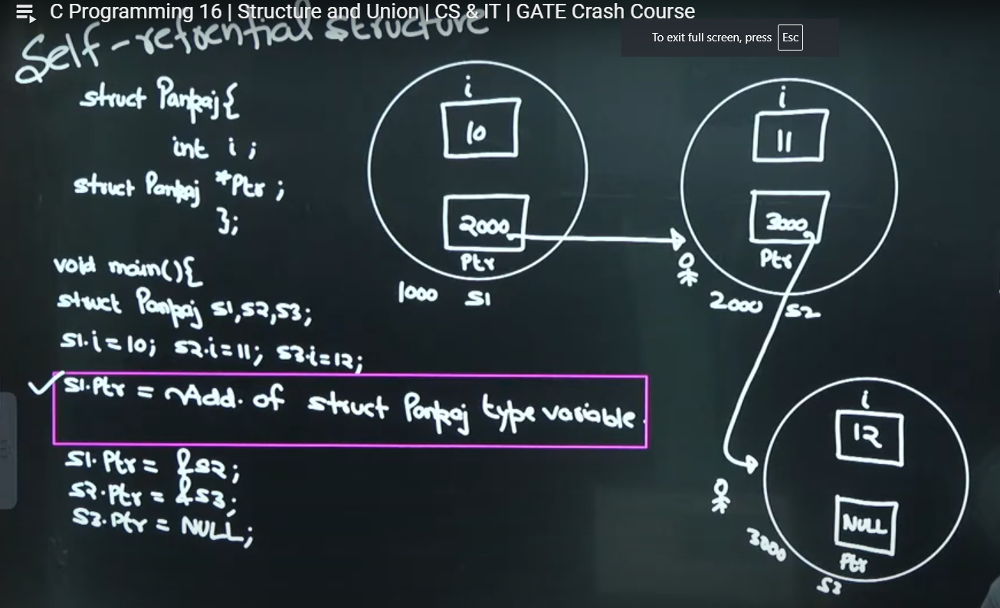

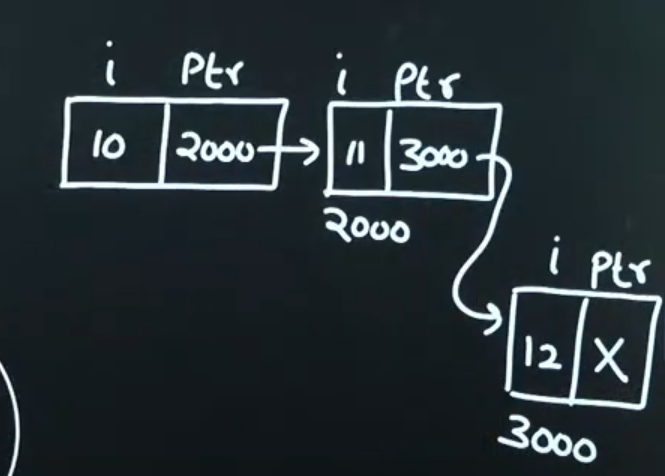

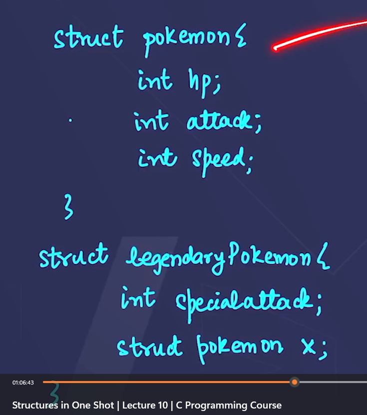

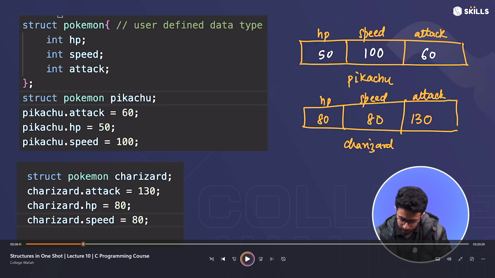

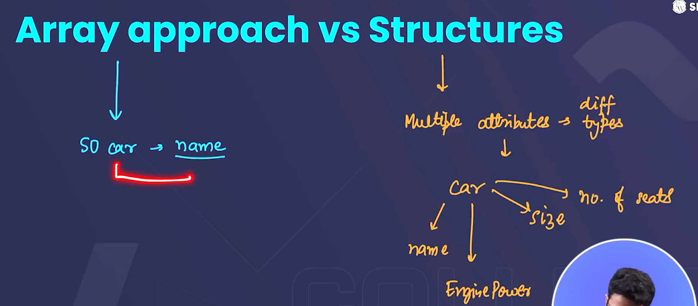

- a structure can contain an array (or string ) within it .
- dot operator ( . ) is used to access attributes .

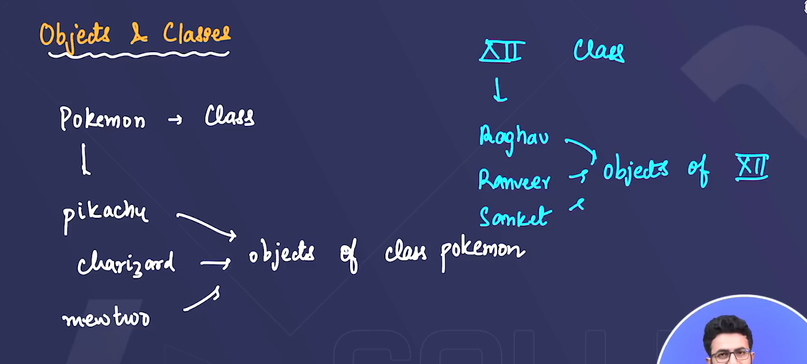

## Array of structure

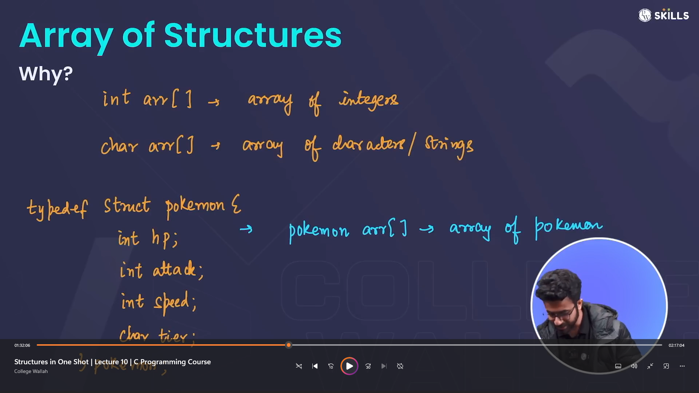  

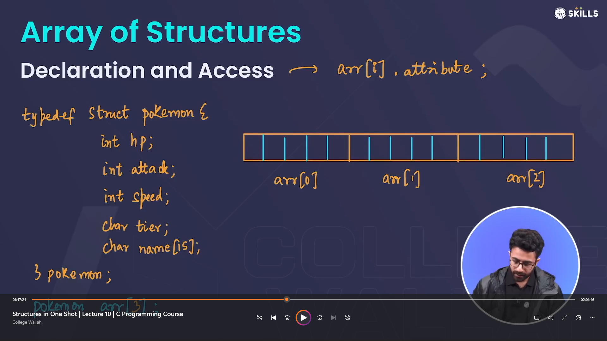

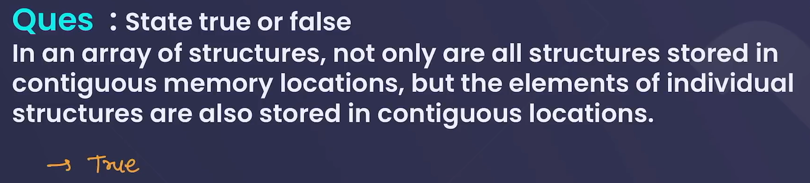

## Nesting of Structure

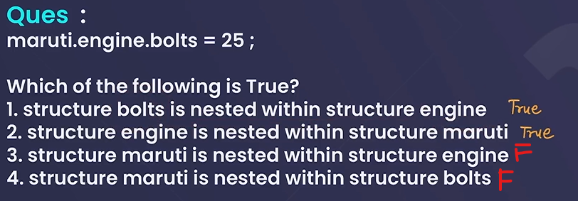

## Structure Pointer

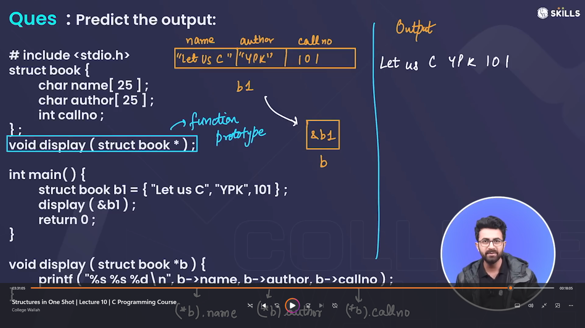

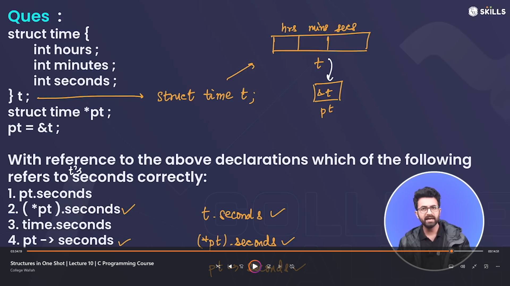

## Structure v/s Union

- both are same but only one change that in unions only one member can be used at a time .
- size of union will be equl to the size of its largest member .
- if all members are initialised then all members will be used (or initialized or store there data in union) but as soon as the next member is used previous members data is overwritten (destroyed) , so at last only the last member is used (or last member is printed).  

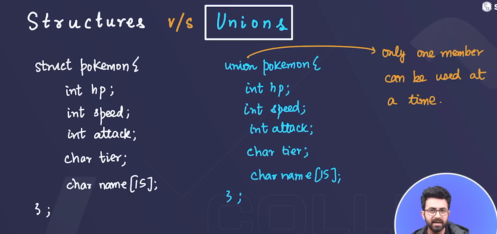

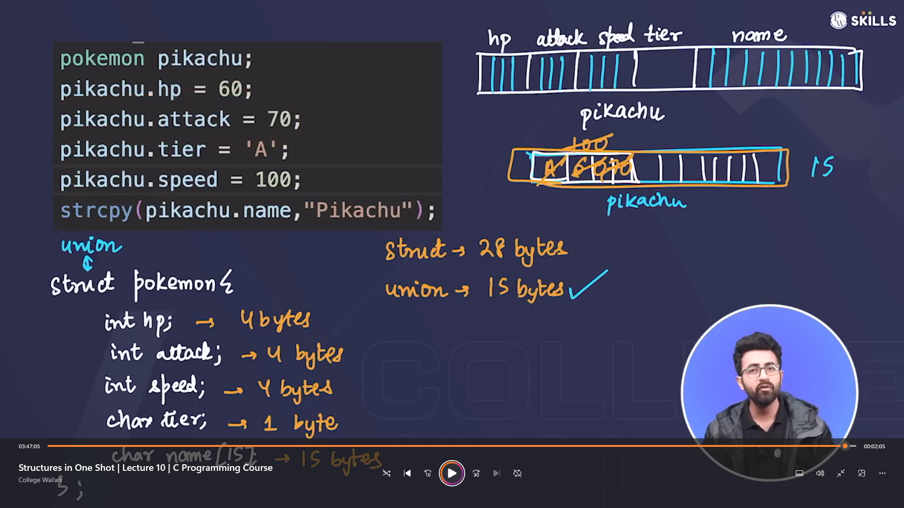
